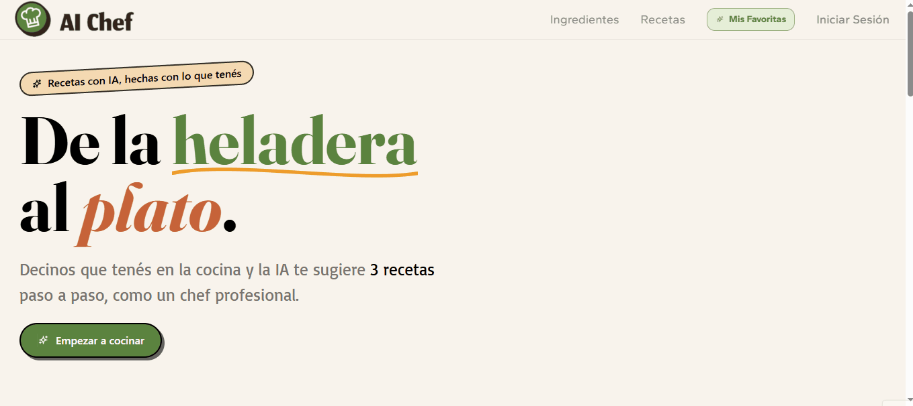
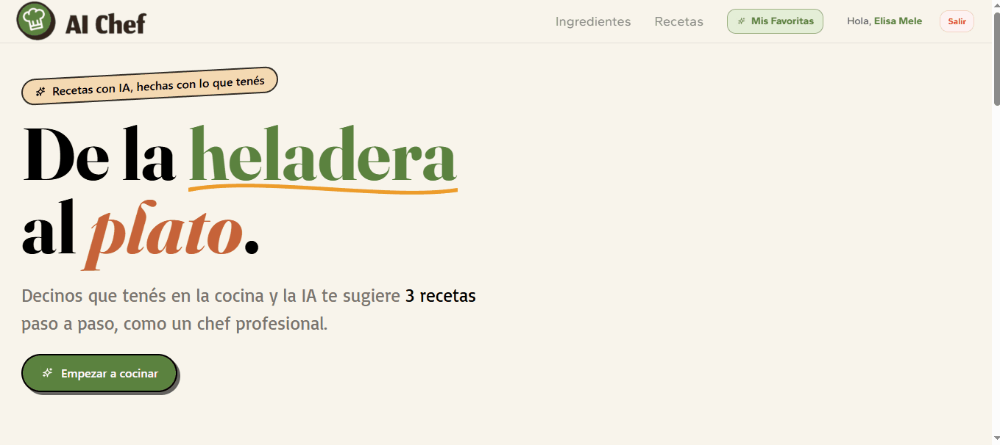
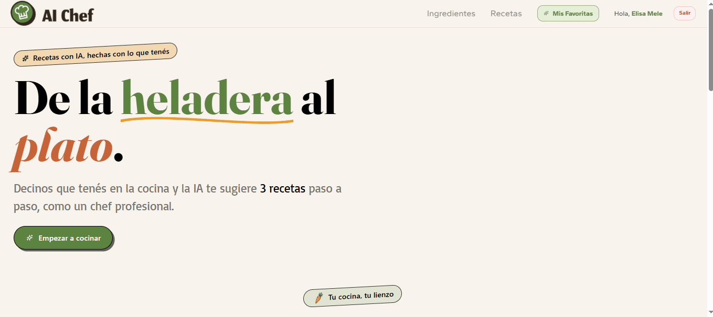

[](https://www.java.com/)
[](https://spring.io/projects/spring-boot)
[](https://www.postgresql.org/)
[](https://www.docker.com/)
[](https://developer.mozilla.org/en-US/docs/Web/JavaScript)
[](https://developer.mozilla.org/en-US/docs/Web/HTML)
[](https://developer.mozilla.org/en-US/docs/Web/CSS)

# 🍳🤖 IA-CHEF 

Aplicación web desarrollada con Spring Boot que genera recetas utilizando inteligencia artificial a partir de los ingredientes seleccionados por el usuario.

## 📌 Descripción

IA-CHEF permite elegir ingredientes de forma interactiva, generar recetas mediante la API de Groq y guardar recetas favoritas en una base de datos PostgreSQL.

### Vista general de la aplicación


### Generación de recetas


### Recetas guardadas


### Registro de usuario


## ✨ Características

- Generación de recetas mediante IA
- Selección interactiva de ingredientes
- Drag & drop de ingredientes
- Persistencia de recetas favoritas
- Integración con PostgreSQL
- Dockerización completa
- Interfaz responsive

## Tecnologías principales

- Java 21
- Spring Boot
- Thymeleaf
- PostgreSQL
- Docker / Docker Compose
- JavaScript Vanilla
- Tailwind CSS

## 📂 Estructura del proyecto

```bash
src/
├── controller/
├── service/
├── repository/
├── model/
├── dto/
├── templates/
└── static/
```

## 🔄 Flujo de funcionamiento
1. El usuario selecciona ingredientes.
2. El frontend envía los datos al backend.
3. Spring Boot construye un prompt para Groq.
4. La IA devuelve recetas en formato JSON.
5. Las recetas se renderizan dinámicamente.
6. El usuario puede guardar recetas favoritas.

## 🧩 Componentes clave

### `RecetaController`

Controlador principal encargado de manejar las rutas HTTP relacionadas con la generación y persistencia de recetas.

#### Endpoints principales

| Método | Ruta               | Descripción                                           |
| ------ | ------------------ | ----------------------------------------------------- |
| `GET`  | `/`                | Muestra la pantalla principal con ingredientes        |
| `POST` | `/generar-recetas` | Genera recetas a partir de ingredientes seleccionados |
| `POST` | `/guardar-receta`  | Guarda una receta en PostgreSQL                       |
| `GET`  | `/mis-recetas`     | Obtiene las recetas guardadas                         |

### `RecetaService`

Servicio encargado de la lógica de negocio relacionada con recetas e integración con la API de Groq.

#### Responsabilidades principales

* Construcción dinámica de prompts para la IA
* Comunicación con Groq mediante `RestClient`
* Conversión de respuestas JSON utilizando Jackson
* Persistencia de recetas en PostgreSQL
* Transformación de `RecetaDTO` a entidad `Receta`

### `IngredientService`

Servicio encargado de la gestión y consulta de ingredientes disponibles.

#### Funcionalidades

* Obtención de ingredientes desde PostgreSQL
* Filtrado de ingredientes por categoría
* Comunicación con `IngredientRepository`

## 🗄️ Modelo de datos

### `Receta`

Entidad que representa una receta generada por IA.

| Campo           | Descripción                  |
| --------------- | ---------------------------- |
| `id`            | Identificador único          |
| `nombre`        | Nombre de la receta          |
| `ingredientes`  | Ingredientes utilizados      |
| `instrucciones` | Pasos de preparación         |


### `Ingredient`

Entidad que representa un ingrediente disponible en la aplicación.

| Campo      | Descripción            |
| ---------- | ---------------------- |
| `id`       | Identificador único    |
| `name`     | Nombre del ingrediente |
| `image`    | Imagen representativa  |
| `category` | Categoría asociada     |

* Relación `@ManyToOne` con `Category`.

### `Category`

Entidad utilizada para clasificar ingredientes.

| Campo  | Descripción            |
| ------ | ---------------------- |
| `id`   | Identificador único    |
| `name` | Nombre de la categoría |

* Relación `@OneToMany` con `Ingredient`.

## Configuración de la base de datos

- `application.properties` define la conexión a PostgreSQL:
  - URL: `jdbc:postgresql://db:5432/chefia_db`
  - Usuario: `chefia_user`
  - Contraseña: `chefia_password`
- `spring.jpa.hibernate.ddl-auto=update` permite crear/actualizar tablas automáticamente.
- `ingredientes.sql` se usa para inicializar las tablas `categorias` e `ingredientes`.

## API de IA

- El proyecto está configurado para usar Groq:
  - `GROQ_API_KEY` debe estar disponible en el entorno.
  - `RecetaService` usa `llama-3.1-8b-instant` como modelo.
- El prompt actual exige que la respuesta sea JSON válido sin texto adicional.

## Ejecución local

### Con Maven

```bash
./mvnw spring-boot:run
```

La aplicación arranca en `http://localhost:8080`.

### Con Docker Compose

```bash
# Desde la carpeta raíz:
# Crear el archivo .env con la clave de Groq
echo GROQ_API_KEY=tu_api_key_aqui > .env

# Levantar la app y la base de datos
docker compose up --build
```

Esto levanta:
- `db`: PostgreSQL con datos iniciales.
- `chefia-backend`: Spring Boot conectado a la base de datos.

```bash
# Detener y remover los contenedores
docker compose down -v
```

## Variables de entorno necesarias

- `GROQ_API_KEY`: clave para la API de Groq.

Opcionalmente, el contenedor puede recibir variables Spring de conexión si se desea sobrescribir la configuración.

## Estructura de archivos relevante

- `Dockerfile`: build de producción.
- `Dockerfile.dev`: contenedor de desarrollo con volumen montado.
- `docker-compose.yml`: orquesta app + PostgreSQL.
- `src/main/resources/static/js/filters.js`: lógica de arrastrar ingredientes, búsqueda y renderizado de recetas.
- `src/main/resources/static/css/style.css`: estilos globales.
- `ingredientes.sql`: script de creación y datos iniciales para PostgreSQL.

## Mejoras futuras

- Filtros alimenticios
- Recomendaciones personalizadas
- App mobile
- Externalizar configuración de Groq
- Incorporar testing automatizado
- Agregar autenticación OAuth2

## 👥 Autores
- Ayelén Corrillo
- Elisa Mele
- Gastón Perrone

## 📄 Licencia

Proyecto desarrollado con fines educativos.